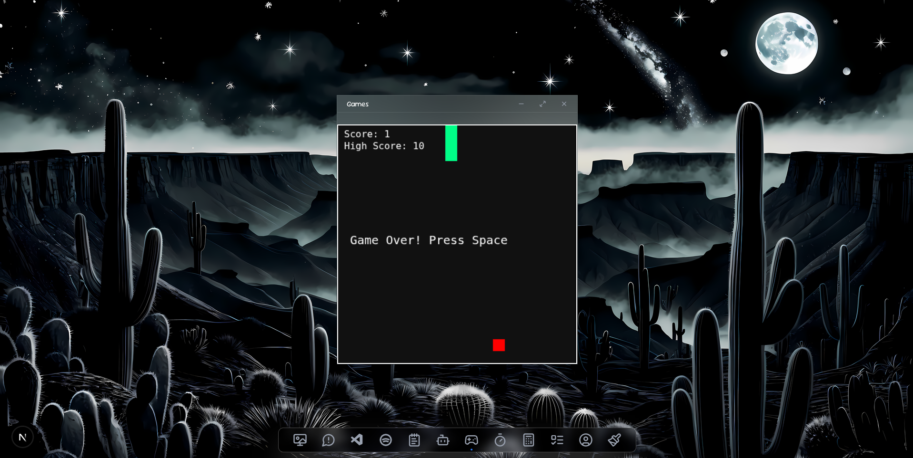

# West OS
---

## Overview

West Portfolio OS Theme is a desktop-like UI built with React and Next.js, featuring a custom taskbar, draggable & resizable windows, multitasking capabilities, AI chatbot integration, and several interactive apps like a code editor, paint app, stopwatch, and snake game.

---

## Features

- Custom taskbar with app icons and tooltips
- Global state management using Redux Toolkit
- Draggable and resizable application windows (powered by Framer Motion)
- Minimize/maximize functionality for windows
- Syntax highlighting in AI chatbot responses
- Integration with Gemini AI API for chatbot
- Multi-tasking support with split screen
- Various built-in apps: Stopwatch, Paint, Snake Game, NoteApp, Mini Spotify, Code Editor, Wallpaper app, Visitor feedback page, and more

---

## Screenshots

### HomeScreen  


### Code Editor  


### Multi Tasking  


### Split Screen  


### AI Chatbot  


### Game  


---

## Progress Updates

### 🗓️ May 11, 2025
- Added a custom taskbar with app icons
- Integrated tooltips using Aceternity UI
- Set up global state with Redux Toolkit
- Built `currOpenTools` slice to manage open apps
- Created `ToolsRender` to display tools dynamically
- Implemented add/remove open apps logic
- Added drag and resize features using Framer Motion

### 🗓️ May 13, 2025
- Implemented minimize feature
- Finalized most UI components

### 🗓️ May 16, 2025
- Improved font styling
- Refreshed core React concepts

### 🗓️ May 17, 2025
- Made Stopwatch app functional
- Optimized drag to only happen when dragging top bar
- Themed apps colors consistently
- Completed Paint app

### 🗓️ May 18, 2025
- Integrated Gemini API with Next.js API route and Google GenAI SDK
- Added syntax highlighting for code responses in chatbot
- Made chatbot responsive for fullscreen

### 🗓️ May 19, 2025
- Finished NoteApp
- Created Mini Spotify app (with 30s playback limitation)

### 🗓️ May 20, 2025
- Developed live-coding Snake game app
- Added Prisma ORM and integrated Supabase DB

### 🗓️ May 21, 2025
- Added visitor feedback page with Axios for data fetching

### 🗓️ May 22, 2025
- Replaced Prisma with Mongoose due to deployment errors
- Completed code editor (a big time investment!)

### 🗓️ May 27, 2025
- Built Wallpaper app
- Fixed bugs and polished final touches
- Project completion 🎉

---

## Technical Insights

- Learned and applied Redux Toolkit for state management (after refreshing knowledge)
- Discovered useful Framer Motion properties like `layout` and `dragMomentum`
- Differentiated between `useState` (causes re-render) and `useRef` (does not)
- Implemented drag feature only on app top bar for better UX, preventing conflicts like dragging during paint drawing
- Used AnimatePresence for smooth mounting/unmounting animations in React components

---
## Tech Stack

- **React** — Frontend UI library  
- **Redux Toolkit** — Global state management  
- **Motion.dev** — Animations, drag and resize functionality  
- **Next.js** — React framework for server-side rendering and API routes  
- **TypeScript** — Static typing for safer, scalable code  
- **Aceternity UI** — Tooltips and UI components  
- **Mongoose + MongoDB** — Database and ORM for data persistence  
- **Axios** — HTTP client for API requests  
- **@google/genai SDK** — AI chatbot integration via Gemini API  


## Getting Started

### Prerequisites
- Node.js (v16+)
- npm or yarn

### Installation

```bash
git clone https://github.com/Westttttttt/West-Portfolio-OS_theme.git
cd West-Portfolio-OS_theme
npm install or yarn 
npm run dev yarn dev
